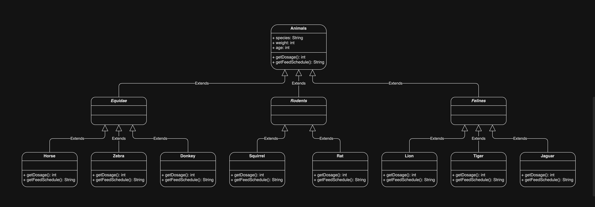

# Hayvanat Bahçesi Yönetim Sistemi

**1-** Hayvanlar:

**2-** Atlar (atlar, zebralar, eşekler vb.),

**3-** Kedigiller (kaplanlar, aslanlar vb.),

**4-** Kemirgenler (sıçanlar, kunduzlar vb.) gibi gruplardaki türlerle karakterize edilir.

**5-** Hayvanlar hakkında depolanan bilgilerin çoğu tüm gruplamalar için aynıdır.

**6-** Tür adı, ağırlığı, yaşı vb.

**7-** Sistem ayrıca her hayvan için belirli ilaçların dozajını alabilmeli => getDosage ()

**8-** Sistem Yem verme zamanlarını hesaplayabilmelidir => getFeedSchedule ()

## Class Diagram

